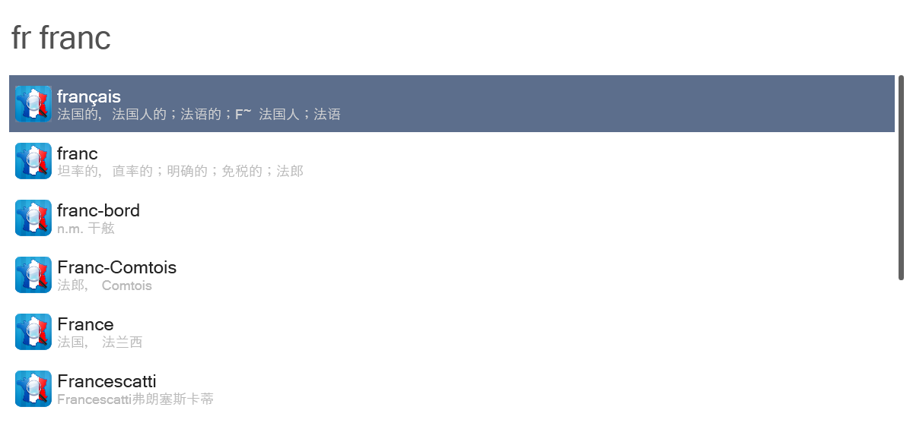
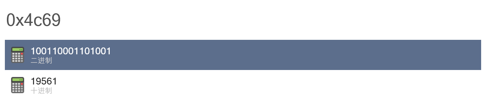

# Wox 插件集合

[Wox](http://www.wox.one/) 是一款开源的 Windows 平台的启动器，与 macOS 上著名的同类 App [Alfred](https://www.alfredapp.com/) 一样，它也支持通过编写插件扩展自身的功能。以下是本仓库中的 Wox 插件简介。

[到 Releases 下载](https://github.com/JeziL/WoxPlugins/releases/latest)

## YouDaoDict

**通过[有道词典](https://www.youdao.com/)进行英译汉查询。**

## FrDict

**通过[法语助手](http://www.frdic.com/)进行法译汉查询。**

## CurrencyConverter

**多种货币对人民币汇率转换。** 使用前需[在此](https://free.currencyconverterapi.com/free-api-key)申请免费 API Key，并将其填入 Wox 插件设置页面。支持的所有货币代码[见此](https://github.com/JeziL/WoxPlugins/blob/master/CurrencyConverter/CurrencyConverter.cs#L15)。

## NumberBase

**进制转换。** 分别使用 `0b`、`0d` 和 `0x` 作为前缀在二进制、十进制和十六进制之间进行转换。

## SteamGuard

**获取 Steam 手机令牌的动态验证代码。** 使用前需参考[这里](https://github.com/SteamTimeIdler/stidler/wiki/Getting-your-%27shared_secret%27-code-for-use-with-Auto-Restarter-on-Mobile-Authentication)获取 Steam 账户的 `shared_secret`，并将其填入 Wox 插件设置页面。

