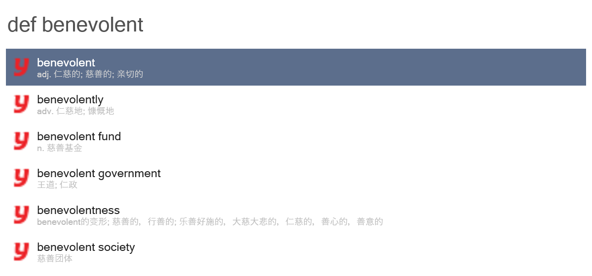

# Wox 插件集合

[Wox](http://www.wox.one/) 是一款开源的 Windows 平台的启动器，与 macOS 上著名的同类 App [Alfred](https://www.alfredapp.com/) 一样，它也支持通过编写插件扩展自身的功能。以下是本仓库中的 Wox 插件简介。

## YouDaoDict

**通过有道词典进行英译汉查询。**

## CurrencyConverter

**多种货币对人民币汇率转换。** 使用前需[在此](https://free.currencyconverterapi.com/free-api-key)申请免费 API Key，并将 API Key 保存为纯文本文件 `APIKEY`（无扩展名），放置于插件目录下。支持的所有货币代码[见此](https://github.com/JeziL/WoxPlugins/CurrencyConverter/CurrencyConverter.cs#L13)。

## SteamGuard

**获取 Steam 手机令牌的动态验证代码。** 使用前需参考[这里](https://github.com/SteamTimeIdler/stidler/wiki/Getting-your-%27shared_secret%27-code-for-use-with-Auto-Restarter-on-Mobile-Authentication)获取 Steam 账户的 `shared_secret`，并将其保存为纯文本文件 `SECRET`（无扩展名），放置于插件目录下。

